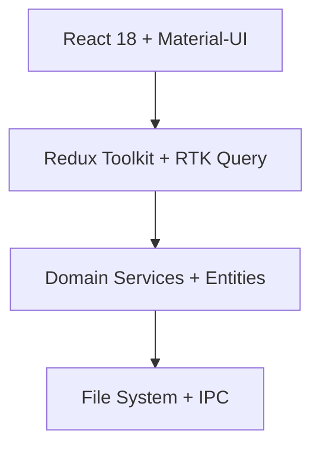
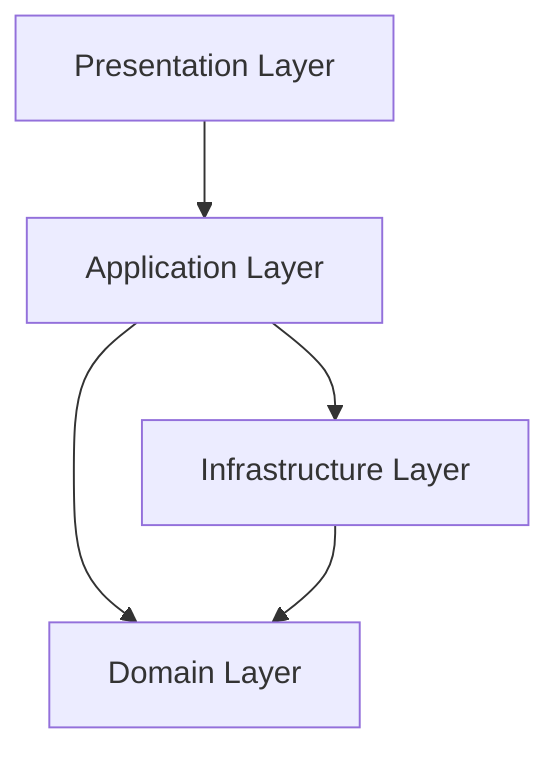
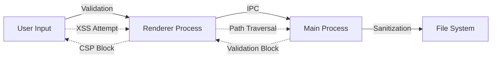
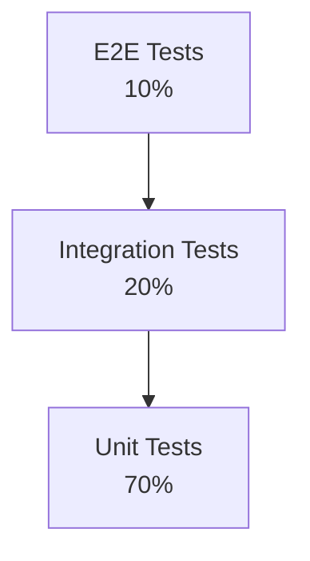
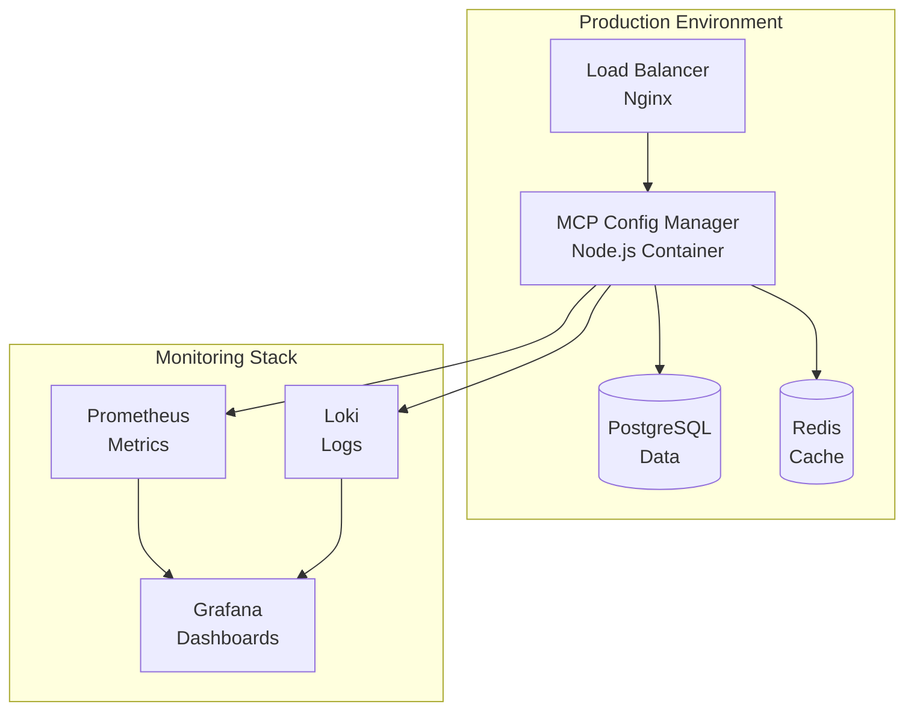

# Architecture Guide

Comprehensive architectural documentation for MCP Config Manager v2.

## 📋 Table of Contents

- [Overview](#overview)
- [Domain-Driven Design](#domain-driven-design)
- [Type System Architecture](#type-system-architecture)
- [Layered Architecture](#layered-architecture)
- [State Management](#state-management)
- [Security Architecture](#security-architecture)
- [Testing Architecture](#testing-architecture)
- [Deployment Architecture](#deployment-architecture)

## 🎯 Overview

MCP Config Manager v2 follows Domain-Driven Design (DDD) principles with a layered architecture that emphasizes type safety, testability, and maintainability.

### Architectural Principles

1. **Type Safety First**: Strict TypeScript with branded types and exhaustive checking
2. **Domain-Centric**: Business logic isolated in domain layer
3. **Dependency Inversion**: High-level modules don't depend on low-level modules
4. **Single Responsibility**: Each component has one reason to change
5. **Open/Closed**: Open for extension, closed for modification
6. **Testability**: Every component is unit testable in isolation

### Technology Stack



## 🏗 Domain-Driven Design

### Bounded Contexts

The application is organized into distinct bounded contexts:

```
┌─────────────────────────────────────────────────────────────┐
│                    MCP Config Manager                       │
├─────────────────┬─────────────────┬─────────────────────────┤
│   Server        │ Configuration   │      System             │
│   Management    │   Management    │      Management         │
│                 │                 │                         │
│ • Server CRUD   │ • Config CRUD   │ • File Operations       │
│ • Lifecycle     │ • Validation    │ • IPC Communication     │
│ • Monitoring    │ • Import/Export │ • Security              │
│ • Health Checks │ • Templates     │ • Logging               │
└─────────────────┴─────────────────┴─────────────────────────┘
```

### Domain Entities

#### Server Aggregate

```typescript
// Server aggregate root
interface MCPServer {
  readonly id: UUID;
  readonly name: ServerName;
  readonly configuration: ServerConfiguration;
  readonly status: ServerStatus;
  readonly metrics: ServerMetrics;
  readonly healthCheck: HealthCheckConfig;
  // ... other properties
}

// Value objects
interface ServerConfiguration {
  readonly command: Command;
  readonly args: readonly string[];
  readonly environment: ReadonlyMap<EnvironmentVariable, EnvironmentValue>;
  // ... other properties
}

// Domain events
type ServerEvent = 
  | { type: 'ServerStarted'; serverId: UUID; timestamp: ISODateString }
  | { type: 'ServerStopped'; serverId: UUID; reason: string; timestamp: ISODateString }
  | { type: 'ServerCrashed'; serverId: UUID; error: Error; timestamp: ISODateString };
```

#### Configuration Aggregate

```typescript
interface MCPConfiguration {
  readonly id: UUID;
  readonly metadata: ConfigurationMetadata;
  readonly servers: ReadonlyMap<UUID, MCPServer>;
  readonly globalSettings: ConfigurationGlobalSettings;
  readonly validation: ConfigurationValidationResult;
  // ... other properties
}
```

### Repository Pattern

```typescript
interface IServerRepository {
  findById(id: UUID): Promise<Result<MCPServer | null>>;
  findAll(filters?: ServerFilters): Promise<Result<MCPServer[]>>;
  save(server: MCPServer): Promise<Result<MCPServer>>;
  delete(id: UUID): Promise<Result<void>>;
}

interface IConfigurationRepository {
  load(filePath?: FilePath): Promise<Result<MCPConfiguration>>;
  save(config: MCPConfiguration, filePath?: FilePath): Promise<Result<void>>;
  export(config: MCPConfiguration, options: ExportOptions): Promise<Result<void>>;
  import(filePath: FilePath, options: ImportOptions): Promise<Result<MCPConfiguration>>;
}
```

### Domain Services

```typescript
class ServerLifecycleService {
  constructor(
    private serverRepository: IServerRepository,
    private processManager: IProcessManager,
    private eventBus: IEventBus
  ) {}

  async startServer(id: UUID): Promise<Result<void>> {
    const serverResult = await this.serverRepository.findById(id);
    if (serverResult.kind === 'failure') return serverResult;
    
    const server = serverResult.value;
    if (!server) return { kind: 'failure', error: new Error('Server not found') };
    
    // Domain logic for starting server
    const result = await this.processManager.start(server.configuration);
    if (result.kind === 'success') {
      await this.eventBus.publish({
        type: 'ServerStarted',
        serverId: id,
        timestamp: new Date().toISOString() as ISODateString
      });
    }
    
    return result;
  }
}
```

## 🔢 Type System Architecture

### Branded Types

Branded types prevent accidental misuse of primitive types:

```typescript
// Brand definition
declare const __brand: unique symbol;
type Brand<T, TBrand> = T & { [__brand]: TBrand };

// Branded type definitions
type UUID = Brand<string, 'UUID'>;
type ServerName = Brand<string, 'ServerName'>;
type Command = Brand<string, 'Command'>;
type FilePath = Brand<string, 'FilePath'>;
type ISODateString = Brand<string, 'ISODateString'>;

// Type guards
const isUUID = (value: string): value is UUID => {
  return /^[0-9a-f]{8}-[0-9a-f]{4}-[1-5][0-9a-f]{3}-[89ab][0-9a-f]{3}-[0-9a-f]{12}$/i.test(value);
};

// Safe constructors
const createUUID = (value?: string): UUID => {
  if (value && !isUUID(value)) {
    throw new TypeError(`Invalid UUID format: ${value}`);
  }
  return (value || crypto.randomUUID()) as UUID;
};
```

### Discriminated Unions

For exhaustive type checking:

```typescript
// Server status with discriminated union
type ServerStatus = 
  | { kind: 'stopped'; since: ISODateString; reason?: string }
  | { kind: 'starting'; since: ISODateString; progress?: number }
  | { kind: 'running'; since: ISODateString; pid: number }
  | { kind: 'stopping'; since: ISODateString; signal?: string }
  | { kind: 'error'; since: ISODateString; error: ServerError; retryCount: number };

// Exhaustive pattern matching
const getStatusDisplay = (status: ServerStatus): string => {
  switch (status.kind) {
    case 'stopped':
      return `Stopped${status.reason ? ` (${status.reason})` : ''}`;
    case 'starting':
      return `Starting${status.progress ? ` (${status.progress}%)` : ''}`;
    case 'running':
      return `Running (PID: ${status.pid})`;
    case 'stopping':
      return `Stopping${status.signal ? ` (${status.signal})` : ''}`;
    case 'error':
      return `Error: ${status.error.message}`;
    default:
      // TypeScript ensures this is never reached
      const _exhaustive: never = status;
      throw new Error(`Unhandled status: ${_exhaustive}`);
  }
};
```

### Result Type Pattern

For error handling without exceptions:

```typescript
type Result<T, E = Error> = 
  | { kind: 'success'; value: T }
  | { kind: 'failure'; error: E };

// Utility functions
const success = <T>(value: T): Result<T> => ({ kind: 'success', value });
const failure = <E>(error: E): Result<never, E> => ({ kind: 'failure', error });

// Monadic operations
const map = <T, U, E>(
  result: Result<T, E>,
  fn: (value: T) => U
): Result<U, E> => {
  return result.kind === 'success' 
    ? success(fn(result.value))
    : result;
};

const flatMap = <T, U, E>(
  result: Result<T, E>,
  fn: (value: T) => Result<U, E>
): Result<U, E> => {
  return result.kind === 'success' 
    ? fn(result.value)
    : result;
};
```

## 🏛 Layered Architecture

### Layer Dependencies



### Presentation Layer

React components with Redux for state management:

```typescript
// Component with proper separation
interface ServerCardProps {
  server: MCPServer;
  onServerAction: (action: ServerAction) => void;
}

const ServerCard: React.FC<ServerCardProps> = ({ server, onServerAction }) => {
  // Presentation logic only
  const handleStart = () => onServerAction({ type: 'start', serverId: server.id });
  
  return (
    <Card>
      <ServerInfo server={server} />
      <ServerActions onStart={handleStart} />
    </Card>
  );
};

// Redux slice
const serverSlice = createSlice({
  name: 'servers',
  initialState: serverAdapter.getInitialState({
    loading: { fetching: false, /* ... */ },
    errors: { fetch: null, /* ... */ }
  }),
  reducers: {
    // Synchronous actions
    updateServerStatus: serverAdapter.updateOne,
    updateServerMetrics: serverAdapter.updateOne,
  },
  extraReducers: (builder) => {
    // Async thunk actions
    builder
      .addCase(fetchServers.pending, (state) => {
        state.loading.fetching = true;
      })
      .addCase(fetchServers.fulfilled, (state, action) => {
        state.loading.fetching = false;
        serverAdapter.setAll(state, action.payload.servers);
      });
  }
});
```

### Application Layer

Use cases and application services:

```typescript
@injectable()
class ServerApplicationService {
  constructor(
    @inject('ServerService') private serverService: IServerService,
    @inject('NotificationService') private notificationService: INotificationService,
    @inject('EventBus') private eventBus: IEventBus
  ) {}

  async startServer(request: StartServerRequest): Promise<StartServerResponse> {
    try {
      const result = await this.serverService.startServer(request.serverId);
      
      if (result.kind === 'success') {
        await this.notificationService.showSuccess(`Server ${request.serverId} started`);
        return { success: true };
      } else {
        await this.notificationService.showError(`Failed to start server: ${result.error.message}`);
        return { success: false, error: result.error.message };
      }
    } catch (error) {
      const message = error instanceof Error ? error.message : 'Unknown error';
      await this.notificationService.showError(`Failed to start server: ${message}`);
      return { success: false, error: message };
    }
  }
}
```

### Domain Layer

Pure business logic:

```typescript
// Domain entity with behavior
class ServerEntity {
  private constructor(
    private readonly props: ServerProps,
    private readonly id: UUID
  ) {}

  static create(props: CreateServerProps): Result<ServerEntity> {
    // Validation
    if (!isValidServerName(props.name)) {
      return failure(new Error('Invalid server name'));
    }

    // Business rules
    const server = new ServerEntity({
      ...props,
      status: createStoppedStatus(),
      metrics: createInitialMetrics(),
      createdAt: new Date().toISOString() as ISODateString,
      updatedAt: new Date().toISOString() as ISODateString,
      version: 1
    }, createUUID());

    return success(server);
  }

  start(): Result<ServerEvent[]> {
    if (this.props.status.kind !== 'stopped') {
      return failure(new Error('Server is not stopped'));
    }

    this.props.status = createStartingStatus();
    this.props.updatedAt = new Date().toISOString() as ISODateString;

    return success([{
      type: 'ServerStartRequested',
      serverId: this.id,
      timestamp: this.props.updatedAt
    }]);
  }
}
```

### Infrastructure Layer

External concerns implementation:

```typescript
@injectable()
class FileSystemServerRepository implements IServerRepository {
  constructor(
    @inject('FileSystem') private fileSystem: IFileSystem,
    @inject('Logger') private logger: ILogger
  ) {}

  async findById(id: UUID): Promise<Result<MCPServer | null>> {
    try {
      const filePath = this.getServerFilePath(id);
      const exists = await this.fileSystem.exists(filePath);
      
      if (!exists) {
        return success(null);
      }

      const content = await this.fileSystem.readFile(filePath);
      const server = this.deserializeServer(content);
      
      return success(server);
    } catch (error) {
      this.logger.error('Failed to find server by ID', { id, error });
      return failure(error instanceof Error ? error : new Error('Unknown error'));
    }
  }
}
```

## 🔄 State Management

### Redux Architecture

```typescript
// Root state type
interface RootState {
  servers: ServersState;
  configurations: ConfigurationsState;
  ui: UIState;
}

// Feature slice with RTK Query
const serverApi = createApi({
  reducerPath: 'serverApi',
  baseQuery: fakeBaseQuery<string>(),
  tagTypes: ['Server'],
  endpoints: (builder) => ({
    getServers: builder.query<ServerQueryResult, ServerFilters>({
      queryFn: async (filters) => {
        const result = await serverService.getServers(filters);
        return result.kind === 'success' 
          ? { data: result.value }
          : { error: result.error.message };
      },
      providesTags: ['Server']
    }),
    startServer: builder.mutation<void, UUID>({
      queryFn: async (serverId) => {
        const result = await serverService.startServer(serverId);
        return result.kind === 'success'
          ? { data: undefined }
          : { error: result.error.message };
      },
      invalidatesTags: ['Server']
    })
  })
});
```

### Reactive Updates

```typescript
// Real-time status updates
const useServerStatusUpdates = (serverId: UUID) => {
  const dispatch = useAppDispatch();
  
  useEffect(() => {
    const subscription = serverStatusObservable
      .pipe(
        filter(update => update.serverId === serverId),
        distinctUntilChanged((a, b) => a.status.kind === b.status.kind)
      )
      .subscribe(update => {
        dispatch(updateServerStatus({
          id: update.serverId,
          changes: { status: update.status }
        }));
      });

    return () => subscription.unsubscribe();
  }, [serverId, dispatch]);
};
```

## 🔒 Security Architecture

### Threat Model



### Security Layers

1. **Input Validation**: All user inputs validated with Zod schemas
2. **Content Security Policy**: Strict CSP headers prevent XSS
3. **Path Validation**: File system access validated for traversal attacks
4. **IPC Security**: Type-safe communication with validation
5. **Process Isolation**: Renderer process runs with limited privileges

### Implementation

```typescript
// Input validation with Zod
const ServerConfigurationSchema = z.object({
  command: z.string().min(1).max(1000),
  args: z.array(z.string().max(1000)).max(100),
  workingDirectory: z.string().optional(),
  environment: z.map(z.string(), z.string()).optional()
});

// Path validation
const validateFilePath = (filePath: string): boolean => {
  const normalizedPath = path.normalize(filePath);
  
  // Check for directory traversal
  if (normalizedPath.includes('..') || normalizedPath.startsWith('/')) {
    return false;
  }
  
  // Check for null bytes
  if (normalizedPath.includes('\0')) {
    return false;
  }
  
  return true;
};

// IPC handler with validation
ipcMain.handle('server:create', async (event, input: unknown) => {
  try {
    // Validate input
    const validatedInput = ServerConfigurationSchema.parse(input);
    
    // Sanitize strings
    const sanitizedInput = {
      ...validatedInput,
      command: sanitizeInput(validatedInput.command),
      args: validatedInput.args.map(sanitizeInput)
    };
    
    // Execute business logic
    const result = await serverService.createServer(sanitizedInput);
    
    return result.kind === 'success'
      ? { success: true, data: result.value }
      : { success: false, error: result.error.message };
  } catch (error) {
    logger.error('Server creation failed', error);
    return { success: false, error: 'Invalid input' };
  }
});
```

## 🧪 Testing Architecture

### Test Pyramid



### Test Categories

1. **Unit Tests**: Domain entities, value objects, pure functions
2. **Integration Tests**: Service interactions, repository implementations
3. **Component Tests**: React components with user interactions
4. **E2E Tests**: Complete user workflows
5. **Accessibility Tests**: WCAG compliance validation

### Test Implementation

```typescript
// Unit test with proper isolation
describe('ServerEntity', () => {
  describe('create', () => {
    it('should create server with valid input', () => {
      const input = {
        name: 'Test Server' as ServerName,
        configuration: createValidConfiguration()
      };

      const result = ServerEntity.create(input);

      expect(result.kind).toBe('success');
      if (result.kind === 'success') {
        expect(result.value.getName()).toBe('Test Server');
        expect(result.value.getStatus().kind).toBe('stopped');
      }
    });

    it('should fail with invalid name', () => {
      const input = {
        name: '' as ServerName,
        configuration: createValidConfiguration()
      };

      const result = ServerEntity.create(input);

      expect(result.kind).toBe('failure');
      if (result.kind === 'failure') {
        expect(result.error.message).toBe('Invalid server name');
      }
    });
  });
});

// Integration test with real dependencies
describe('ServerService Integration', () => {
  let service: IServerService;
  let repository: IServerRepository;
  let processManager: IProcessManager;

  beforeEach(() => {
    const container = createTestContainer();
    service = container.get<IServerService>('ServerService');
    repository = container.get<IServerRepository>('ServerRepository');
    processManager = container.get<IProcessManager>('ProcessManager');
  });

  it('should start server and update status', async () => {
    // Arrange
    const server = await createTestServer();
    await repository.save(server);

    // Act
    const result = await service.startServer(server.getId());

    // Assert
    expect(result.kind).toBe('success');
    expect(processManager.start).toHaveBeenCalledWith(server.getConfiguration());
  });
});

// Component test with accessibility
describe('ServerCard Component', () => {
  it('should render server information correctly', () => {
    const server = createTestServer();
    
    renderWithProviders(
      <ServerCard server={server} onServerAction={jest.fn()} />
    );

    expect(screen.getByRole('heading', { name: server.name })).toBeInTheDocument();
    expect(screen.getByText(getStatusDisplay(server.status))).toBeInTheDocument();
  });

  it('should have no accessibility violations', async () => {
    const server = createTestServer();
    const { container } = renderWithProviders(
      <ServerCard server={server} onServerAction={jest.fn()} />
    );

    await checkAccessibility(container);
  });
});
```

## 🚀 Deployment Architecture

### Container Architecture



### Deployment Environments

1. **Development**: Hot reload, debug mode, mock services
2. **Staging**: Production-like environment with test data
3. **Production**: Optimized build with monitoring and security

### Infrastructure as Code

```yaml
# docker-compose.yml
services:
  app:
    build:
      context: .
      target: production
    environment:
      - NODE_ENV=production
      - LOG_LEVEL=warn
    volumes:
      - config_data:/app/config
      - log_data:/app/logs
    healthcheck:
      test: ["CMD", "curl", "-f", "http://localhost:3000/health"]
      interval: 30s
      timeout: 10s
      retries: 3
```

### CI/CD Pipeline

```yaml
# .github/workflows/ci.yml
jobs:
  test:
    strategy:
      matrix:
        os: [ubuntu-latest, windows-latest, macos-latest]
    steps:
      - uses: actions/checkout@v4
      - uses: actions/setup-node@v4
      - run: npm ci
      - run: npm run validate
      - run: npm run test:coverage
      
  deploy:
    needs: test
    if: github.ref == 'refs/heads/main'
    steps:
      - run: ./scripts/deploy.sh production
```

This architecture provides a solid foundation for a maintainable, scalable, and secure application while maintaining type safety and comprehensive testing throughout all layers.